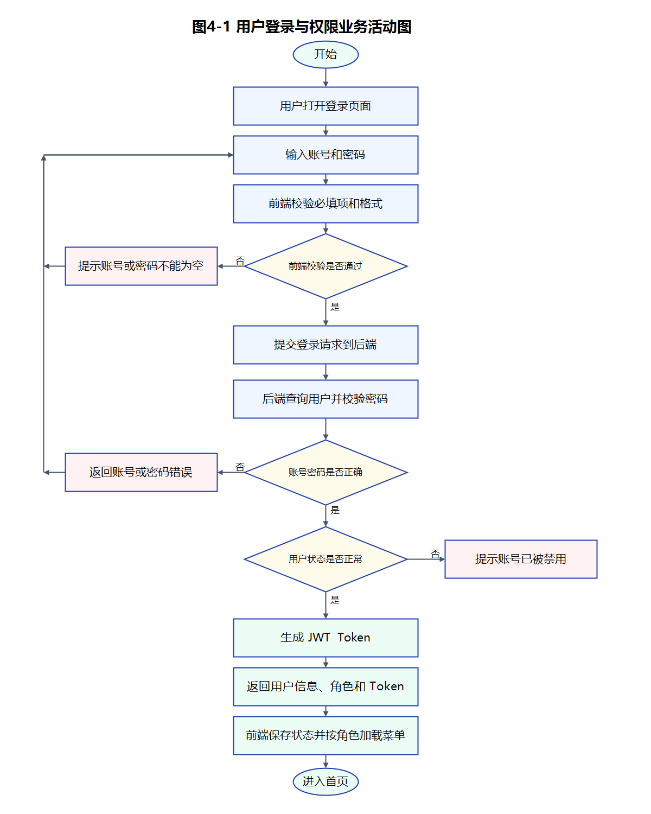
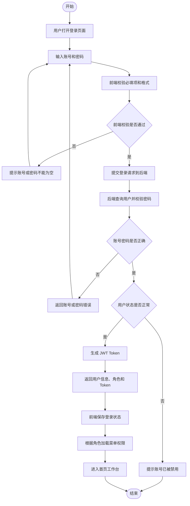

# 个性化智慧校园助手需求分析说明书

文档编号：CA-SRS-20260603

产品版本：V1.0

密级：内部

文件状态：正式发布

项目名称：基于 SpringBoot + Vue 的个性化智慧校园助手的设计与实现

文档作者：毕业设计项目组

项目组长：李泽权

批准日期：2026年06月03日

## 版本记录

| 版本 | 作者 | 参与者 | 日期 | 注释 |
| --- | --- | --- | --- | --- |
| V1.0 | 李泽权 | 毕业设计项目组 | 2026年06月03日 | 根据项目功能、前端优化文档和教师模板编写需求分析说明书 |

## 目录

1. 引言
2. 项目概述
3. 系统总体功能
4. 业务需求分析
5. 系统功能需求
6. 系统需求优先级
7. 非功能需求
8. 其他事项
9. 附录

## 1 引言

### 1.1 编写目的

本文档用于明确“基于 SpringBoot + Vue 的个性化智慧校园助手的设计与实现”系统的业务范围、用户角色、核心流程、功能需求、非功能需求和开发优先级，为后续系统设计、编码实现、测试验收和论文撰写提供依据。

通过本需求分析说明书，项目开发人员能够明确系统需要实现的功能边界，测试人员能够依据需求设计测试用例，指导教师和答辩评审人员能够了解系统建设目标与业务价值，最终保证系统开发工作围绕真实校园服务场景展开。

### 1.2 读者对象

本文档主要面向以下读者：

| 读者对象 | 阅读目的 |
| --- | --- |
| 指导教师 | 审阅系统需求完整性、业务合理性和毕业设计工作量 |
| 项目开发人员 | 明确系统开发范围、功能模块、接口边界和业务规则 |
| 测试人员 | 根据功能需求和业务规则编写测试用例 |
| 学生用户代表 | 了解系统能够提供的校园服务能力 |
| 教师用户代表 | 了解系统在预约审核、公告发布、活动管理方面的功能 |
| 管理员 | 了解系统管理、用户维护、日志审计和数据统计能力 |

### 1.3 术语解释

| 名词/术语/缩写词 | 解释 |
| --- | --- |
| 智慧校园助手 | 面向学生、教师、管理员的校园综合服务系统 |
| Spring Boot | Java 后端开发框架，用于构建 RESTful 服务 |
| Vue | 前端框架，用于构建单页应用 |
| MyBatis-Plus | Java 持久层增强框架，用于简化数据库访问 |
| JWT | JSON Web Token，用于无状态身份认证 |
| Redis | 内存数据库，用于缓存、去重、限流等场景 |
| Redisson | Redis Java 客户端，用于分布式锁、延迟队列等能力 |
| Kafka | 分布式消息队列，用于异步通知、日志处理和消息解耦 |
| DLQ | Dead Letter Queue，死信队列，用于处理异常消息和补偿 |
| Bean Validation | 参数校验规范，用于接口入参合法性校验 |
| ECharts | 数据可视化图表库 |
| RBAC | Role-Based Access Control，基于角色的权限控制 |

### 1.4 参考资料

| 资料名称 | 说明 |
| --- | --- |
| 《项目环境与配置文档》 | 项目运行环境、Docker 部署、MySQL、Redis、Kafka 等配置说明 |
| 《后端项目文档》 | 后端技术栈、模块结构、接口规范和业务规则说明 |
| 《前端项目文档》 | 前端技术栈、页面结构、路由权限和交互规范说明 |
| 《智慧校园助手前端 UI 升级文档》 | 前端页面升级、设计系统、交互优化和页面功能说明 |
| 《1.0系统需求分析报告》模板 | 教师提供的需求分析文档模板 |

## 2 项目概述

### 2.1 项目背景

随着高校信息化建设的推进，学生日常学习生活中涉及公告获取、活动报名、场地预约、签到参与、通知接收和校园交流等多个业务场景。传统处理方式往往依赖线下登记、微信群通知、人工审核或多个独立平台，存在信息分散、流程不统一、审核效率低、数据难统计、服务体验不足等问题。

本项目拟设计并实现一个面向高校日常管理和学生服务的个性化智慧校园助手。系统以学生、教师、管理员三类角色为核心，围绕“公告通知、场地预约、活动报名、活动签到、个性化推荐、讨论交流、数据看板、系统管理”等场景进行建设。系统前端采用 Vue 3，后端采用 Spring Boot，数据库采用 MySQL，并结合 Redis、Redisson、Kafka 等技术提升并发控制、消息异步处理和系统可扩展性。

系统服务对象包括：

| 用户类型 | 典型需求 |
| --- | --- |
| 学生 | 查看公告、预约场地、报名活动、参与签到、接收通知、参与讨论、查看推荐内容 |
| 教师 | 审核本院系预约、发布或管理本人权限范围内的公告和活动、查看活动报名情况、参与讨论管理 |
| 管理员 | 管理用户、公告、场地、时间段、活动、日志、统计数据和异常消息 |

系统潜在风险包括：用户权限控制不严、预约名额并发扣减异常、重复报名或重复签到、通知消息消费失败、图片资源访问异常、前端交互复杂度增加等。针对上述风险，系统在需求层面要求后端强制权限校验、使用事务保证业务一致性、通过 Redisson 控制重复执行，通过 Kafka 与 DLQ 支持消息失败补偿。

### 2.2 项目目标

本项目的总体目标是建设一个可落地使用的校园助手系统，满足高校学生服务和院系管理的基本需求，同时具备毕业设计所需的完整业务深度和技术实现价值。

具体目标如下：

1. 建立统一身份认证体系，支持学生、教师、管理员按角色登录和访问不同功能。
2. 实现场地预约业务闭环，包括场地展示、时间段库存、预约申请、教师审核、预约取消和名额释放。
3. 实现活动管理业务闭环，包括活动发布、活动报名、活动签到、签到状态查询和参与统计。
4. 实现校园公告和通知中心，支持公告浏览、详情查看、评论交流和通知已读管理。
5. 实现讨论交流模块，支持发帖、图片上传、评论、帖子点赞、评论点赞、置顶、精华、封禁等论坛能力。
6. 实现个性化推荐，根据用户角色、公告、活动和场地数据展示更适合用户的校园信息。
7. 实现数据看板和统计图表，为学生、教师、管理员提供不同维度的数据展示。
8. 实现系统管理 CRUD，包括用户、公告、场地、时间段、活动等后台管理功能。
9. 实现 AI 客服助手，为学生、教师和管理员提供系统使用问答、业务流程引导和部分个人状态查询能力。
10. 实现 AI 内容审核员，对讨论区帖子和评论进行违规审核与风险提示。
11. 实现日志审计、Kafka 异步消息、DLQ 补偿、Redisson 并发控制等增强能力。
12. 提供良好的前端交互和视觉设计，使系统具备真实校园平台的使用体验。

## 3 系统总体功能

系统按照业务功能划分为 12 个核心模块，分别覆盖身份认证、数据展示、公告通知、预约服务、活动管理、互动交流、个性化服务、个人信息、后台管理、日志审计以及 AI 智能服务等场景。

### 3.1 系统功能结构

```text
个性化智慧校园助手
├─ 用户认证与权限模块
│  ├─ 登录
│  ├─ 退出
│  ├─ 当前用户
│  ├─ 修改密码
│  └─ 角色权限控制
├─ 首页数据看板模块
│  ├─ 统计卡片
│  ├─ 预约状态图
│  ├─ 活动报名图
│  ├─ 场地使用图
│  └─ 签到率图
├─ 校园公告与通知模块
│  ├─ 公告列表
│  ├─ 公告详情
│  ├─ 公告评论
│  ├─ 通知列表
│  └─ 已读状态管理
├─ 场地资源与预约模块
│  ├─ 场地展示
│  ├─ 时间段选择
│  ├─ 预约提交
│  ├─ 预约审核
│  ├─ 预约取消
│  └─ 库存扣减与释放
├─ 活动报名与签到模块
│  ├─ 活动列表
│  ├─ 活动报名
│  ├─ 取消报名
│  ├─ 待签到活动
│  ├─ 活动签到
│  └─ 已签到记录
├─ 讨论交流模块
│  ├─ 发布帖子
│  ├─ 上传图片
│  ├─ 帖子详情
│  ├─ 评论
│  ├─ 帖子点赞
│  ├─ 评论点赞
│  ├─ 置顶/精华
│  └─ 用户封禁
├─ 个性化推荐模块
│  ├─ 推荐公告
│  ├─ 推荐活动
│  └─ 推荐场地
├─ 个人中心模块
│  ├─ 个人资料
│  ├─ 账号信息
│  └─ 修改密码
├─ AI 客服助手模块
│  ├─ 使用问答
│  ├─ 预约引导
│  ├─ 状态查询
│  └─ 常见问题解答
├─ AI 内容审核模块
│  ├─ 帖子审核
│  ├─ 评论审核
│  ├─ 敏感内容识别
│  └─ 风险提示
├─ 系统管理模块
│  ├─ 用户管理
│  ├─ 公告管理
│  ├─ 场地管理
│  ├─ 时间段管理
│  └─ 活动管理
└─ 日志审计模块
   ├─ 登录日志
   ├─ 操作日志
   ├─ 消息日志
   └─ 异常补偿日志
```

### 3.2 系统边界

本系统一期主要面向校园内部用户，不提供游客访问和开放注册功能。学生账号由系统预置或管理员导入，学生初始账号为学号，初始密码可按身份证后六位或初始化密码策略生成。教师和管理员账号由管理员创建或初始化脚本预置。

系统不直接接入真实教务系统、人脸识别设备或门禁设备，后续可通过接口扩展实现。图片资源采用本地上传目录保存并通过静态资源映射访问。

## 4 业务需求分析

### 4.1 用户登录与权限业务

#### 4.1.1 业务需求描述

系统用户进入校园助手前必须登录。登录时输入账号和密码，后端验证用户身份并返回 Token 和用户角色信息。前端根据角色显示不同菜单，后端在接口层再次进行权限判断，避免越权访问。

学生以学号作为登录账号，教师以工号作为登录账号，管理员使用管理员账号登录。系统不允许同一页面同时出现“账号”和“学号”等重复概念，避免用户理解混乱。

#### 4.1.2 业务流程

用户登录与权限业务采用 UML 活动图描述如下。



图4-1 用户登录与权限业务活动图



活动图说明：

1. 前端负责基础输入校验，例如账号、密码是否为空以及长度是否满足要求。
2. 后端负责真实身份认证，包括用户存在性、密码正确性和用户状态校验。
3. 认证成功后，系统生成 JWT Token，并返回用户角色信息。
4. 前端根据角色加载学生、教师或管理员对应菜单。
5. 认证失败时，系统返回明确错误提示，用户可重新输入账号密码。

#### 4.1.3 业务规则

1. 未登录用户不得访问系统业务页面。
2. Token 失效后应自动返回登录页。
3. 密码必须加密存储，不允许明文保存。
4. 学生登录后可修改密码。
5. 管理类接口必须以后端权限校验结果为准。

### 4.2 场地预约业务

#### 4.2.1 业务需求描述

学生可查看可预约场地，选择预约日期和时间段，填写预约原因后提交预约申请。系统需要控制同一学生不能重复预约同一场地同一时间段，并且需要控制时间段剩余名额。教师可按权限审核预约，管理员可进行全局管理。

#### 4.2.2 业务流程

```text
学生选择场地
→ 选择预约日期和时间段
→ 系统展示剩余名额
→ 学生填写预约原因
→ 提交预约申请
→ 后端校验重复预约和库存
→ 扣减时间段剩余名额
→ 创建待审核预约
→ 教师审核通过或驳回
→ 系统发送通知并记录日志
```

#### 4.2.3 业务规则

1. 同一学生不能重复提交同一场地同一时间段的有效预约。
2. 时间段剩余名额不足时不能提交预约。
3. 预约取消后应释放对应时间段名额。
4. 教师通常只审核本院系学生的预约。
5. 管理员拥有全局预约管理权限。
6. 并发预约时应使用 Redisson 分布式锁或数据库事务保证名额不被超卖。

### 4.3 活动报名与签到业务

#### 4.3.1 业务需求描述

学生可查看校园活动，选择感兴趣的活动进行报名。活动开始前或签到开放时间内，学生可在活动签到页面完成签到。系统应显示待签到活动、已签到活动和报名记录，避免重复报名和重复签到。

#### 4.3.2 业务流程

```text
教师或管理员发布活动
→ 学生查看活动中心
→ 学生报名活动
→ 系统校验容量和重复报名
→ 报名成功
→ 到达签到开放时间
→ 学生进入待签到活动
→ 点击签到
→ 系统校验签到时间和重复签到
→ 生成签到记录
```

#### 4.3.3 业务规则

1. 同一学生不能重复报名同一活动。
2. 活动报名人数不能超过活动容量。
3. 同一学生不能重复签到同一活动。
4. 签到必须在活动允许的签到时间范围内完成。
5. 学生未报名活动时原则上不能签到。
6. 活动地点应与场地管理中的场地数据关联，避免手工填写导致数据不一致。

### 4.4 校园公告与通知业务

#### 4.4.1 业务需求描述

教师或管理员可发布校园公告，公告可设置发布范围。学生、教师和管理员都可以查看公告详情，并在公告下发表评论。系统通知中心用于接收预约审核结果、活动提醒、公告通知等消息。

#### 4.4.2 业务流程

```text
教师或管理员发布公告
→ 选择发布范围
→ 系统保存公告
→ 用户查看公告列表
→ 点击公告进入详情
→ 用户发表评论
→ 系统记录评论和时间
→ 相关通知进入通知中心
```

#### 4.4.3 业务规则

1. 教师只能管理自己发布的公告，不可删除同院系其他教师发布的公告。
2. 管理员可管理全部公告。
3. 公告时间统一显示为“2026年06月02日 15:30”格式。
4. 系统不得在页面显示 BOOKING、ACTIVITY 等英文技术字段，应翻译为业务中文。
5. 通知中心应支持单条已读和全部已读。

### 4.5 讨论交流业务

#### 4.5.1 业务需求描述

讨论交流模块用于提供校园论坛能力。学生和教师可以发布帖子、上传图片、评论、点赞。教师可在本院系范围内管理帖子，管理员可进行全站帖子管理和用户封禁。帖子列表应采用论坛式浏览，用户点击帖子后进入详情查看正文和评论。

#### 4.5.2 业务流程

```text
用户进入讨论交流
→ 查看帖子列表
→ 点击帖子进入详情
→ 查看正文、图片和评论
→ 发表评论或点赞评论
→ 作者可删除自己的帖子或评论
→ 教师可管理本院系帖子
→ 管理员可管理全站帖子并封禁违规用户
```

#### 4.5.3 业务规则

1. 学生、教师可发帖、评论、点赞、删除自己的帖子和评论。
2. 教师可置顶或加精本院系帖子。
3. 管理员可删除任意帖子、置顶、加精和封禁用户。
4. 被封禁用户不得继续发帖和评论。
5. 帖子可以上传图片，列表页展示缩略图，详情页展示完整图片。
6. 评论点赞应记录点赞关系，并在事务内同步评论点赞数。

### 4.6 个性化推荐业务

#### 4.6.1 业务需求描述

系统应根据用户角色、公告、活动、场地、预约和报名等数据，为用户提供个性化推荐内容。学生主要推荐可参加活动、相关公告和常用场地；教师主要推荐待处理事项和本院系相关数据；管理员主要展示全局统计和异常处理入口。

#### 4.6.2 业务规则

1. 推荐内容应与用户角色和权限范围匹配。
2. 推荐活动应优先展示未结束且可报名的活动。
3. 推荐场地应优先展示可用场地。
4. 推荐公告应优先展示用户可见范围内的公告。

### 4.7 系统管理业务

#### 4.7.1 业务需求描述

管理员通过系统管理页面维护用户、公告、场地、时间段和活动。系统管理页面应具备基础 CRUD、分页、表单校验、图片上传和删除二次确认能力。

#### 4.7.2 业务规则

1. 用户管理中学生使用学号登录，教师使用工号登录。
2. 管理员可修改场地容量、状态、图片和位置。
3. 活动地点应从场地管理已有数据中选择。
4. 删除操作必须二次确认。
5. 系统管理接口必须仅允许管理员或具备对应权限的教师访问。

### 4.8 AI 客服助手业务

#### 4.8.1 业务需求描述

系统应提供一个面向学生、教师和管理员的 AI 客服助手，作为智慧校园助手的智能前台入口。用户可以通过自然语言询问系统使用问题、业务办理流程、高频校园服务问题，并在必要时查询部分与本人相关的业务状态。

#### 4.8.2 业务规则

1. AI 客服助手优先回答与校园助手系统直接相关的问题，如场地预约、活动报名、活动签到、公告通知和讨论交流。
2. AI 客服助手可结合当前登录用户上下文回答部分个人状态问题，例如最近一条预约的审核状态。
3. AI 客服助手不应编造系统中不存在的数据或学校未提供的制度信息。
4. AI 对话能力应通过独立接口提供，不直接侵入原有业务接口。

### 4.9 AI 内容审核业务

#### 4.9.1 业务需求描述

系统应提供 AI 内容审核员，对讨论区帖子和评论进行自动审核。该模块用于识别政治敏感、色情低俗、暴力辱骂、广告引流等违规内容，并对存在风险的文本进行拦截或提醒，以减轻教师和管理员的人工审查压力。

#### 4.9.2 业务规则

1. 讨论区帖子在发布前必须经过内容审核。
2. 讨论区评论在提交前必须经过内容审核。
3. 审核结果至少分为通过、提示风险、禁止发布三类。
4. 对明显违规内容应直接阻止发布。
5. 对轻微不文明或疑似敏感表达，可给予提示或标记风险。

## 5 系统功能需求

### 5.1 系统总用例图

```text
学生
├─ 登录/退出
├─ 修改密码
├─ 查看公告
├─ 评论公告
├─ 预约场地
├─ 取消预约
├─ 报名活动
├─ 取消报名
├─ 活动签到
├─ 查看通知
├─ 查看推荐
├─ 参与讨论
└─ 使用 AI 客服助手

教师
├─ 登录/退出
├─ 修改密码
├─ 审核本院系预约
├─ 发布/管理本人公告
├─ 发布/管理本人活动
├─ 查看活动报名情况
├─ 参与讨论
├─ 管理本院系帖子
└─ 使用 AI 客服助手

管理员
├─ 登录/退出
├─ 用户管理
├─ 公告管理
├─ 场地管理
├─ 时间段管理
├─ 活动管理
├─ 讨论区全站管理
├─ 日志审计
├─ 数据看板
├─ 异常消息处理
├─ 使用 AI 客服助手
└─ 管理 AI 内容审核
```

### 5.1.1 系统中角色分析

| 角色 | 角色说明 | 主要权限 |
| --- | --- | --- |
| 学生 | 校园助手主要服务对象 | 查看公告、预约场地、报名活动、签到、接收通知、参与讨论、查看推荐、使用 AI 客服助手 |
| 教师 | 院系业务处理人员 | 审核本院系学生预约、发布本人公告和活动、管理本人发布内容、管理本院系讨论内容、使用 AI 客服助手 |
| 管理员 | 系统维护人员 | 全局用户管理、公告管理、场地管理、活动管理、日志审计、数据统计、异常消息处理、使用 AI 客服助手、管理 AI 内容审核 |

### 5.1.2 功能描述

| 模块 | 功能说明 |
| --- | --- |
| 用户认证与权限模块 | 用户输入账号密码登录，系统返回 Token 和用户信息，并按角色控制功能访问范围 |
| 首页数据看板模块 | 根据角色展示统计卡片、待办事项、图表和快捷入口 |
| 校园公告与通知模块 | 展示公告列表、详情、评论、发布范围和通知已读管理功能 |
| 场地资源与预约模块 | 展示场地、时间段和剩余名额，支持预约、审核和取消 |
| 活动报名与签到模块 | 支持活动报名、待签到活动、已签到记录和签到状态展示 |
| 讨论交流模块 | 支持论坛式发帖、评论、点赞、图片、置顶、精华和封禁 |
| 个性化推荐模块 | 按角色和业务数据推荐公告、活动和场地 |
| 个人中心模块 | 展示用户资料、账号信息，并支持修改密码 |
| AI 客服助手模块 | 支持系统使用问答、流程引导、常见问题解答和部分个人业务状态查询 |
| AI 内容审核模块 | 对讨论区帖子和评论进行违规审核、敏感内容识别和风险提示 |
| 日志审计模块 | 查询登录日志、操作日志、消息日志和异常补偿日志 |
| 系统管理模块 | 管理用户、公告、场地、时间段和活动 |

### 5.2 详细功能分析

#### 5.2.1 登录

| 项目 | 内容 |
| --- | --- |
| 用例编号 | UC-001 |
| 用例名称 | 用户登录 |
| 用例描述 | 用户输入账号和密码后，系统校验身份并返回 Token，前端根据角色跳转首页 |
| 执行者 | 学生、教师、管理员 |
| 前置条件 | 用户账号已存在且状态正常 |
| 后置条件 | 用户成功进入系统，前端保存 Token 和用户信息 |

基本事件流：

1. 用户打开登录页面。
2. 用户输入账号和密码。
3. 前端进行必填和长度校验。
4. 后端校验账号、密码和用户状态。
5. 校验成功后生成 JWT。
6. 系统返回用户信息和角色。
7. 前端跳转首页工作台。

扩展流程：

1. 账号或密码错误，系统提示“账号或密码错误”。
2. 用户被禁用，系统提示账号不可用。
3. Token 失效，系统跳转登录页。

特殊需求：

1. 密码必须加密存储。
2. 登录响应时间应控制在 3 秒以内。
3. 不允许在前端保存明文密码。

#### 5.2.2 维护用户

| 项目 | 内容 |
| --- | --- |
| 用例编号 | UC-002 |
| 用例名称 | 用户管理 |
| 用例描述 | 管理员维护学生、教师、管理员账号信息 |
| 执行者 | 管理员 |
| 前置条件 | 管理员已登录 |
| 后置条件 | 用户信息被新增、修改、禁用或删除 |

业务规则：

1. 学生登录号为学号。
2. 教师登录号为工号。
3. 用户密码应使用 BCrypt 加密。
4. 删除用户采用逻辑删除或状态禁用，避免影响历史业务数据。

#### 5.2.3 场地预约

| 项目 | 内容 |
| --- | --- |
| 用例编号 | UC-003 |
| 用例名称 | 提交场地预约 |
| 用例描述 | 学生选择场地、日期、时间段和预约原因后提交预约申请 |
| 执行者 | 学生 |
| 前置条件 | 学生已登录，场地和时间段处于可预约状态 |
| 后置条件 | 生成待审核预约记录，时间段剩余名额扣减 |

基本事件流：

1. 学生进入场地预约页面。
2. 系统展示场地列表和图片。
3. 学生选择场地、日期和时间段。
4. 系统展示剩余名额。
5. 学生填写预约原因。
6. 后端校验重复预约、库存和用户权限。
7. 系统扣减名额并创建预约记录。
8. 系统发送通知并记录操作日志。

扩展流程：

1. 名额不足，系统提示该时间段已满。
2. 重复预约，系统提示不能重复预约。
3. 场地停用，系统拒绝预约。

#### 5.2.4 预约审核

| 项目 | 内容 |
| --- | --- |
| 用例编号 | UC-004 |
| 用例名称 | 审核预约 |
| 用例描述 | 教师或管理员对预约申请进行通过或驳回 |
| 执行者 | 教师、管理员 |
| 前置条件 | 存在待审核预约 |
| 后置条件 | 预约状态更新，学生收到通知 |

业务规则：

1. 教师通常只审核本院系学生预约。
2. 管理员可审核全部预约。
3. 驳回预约应释放已占用名额。
4. 审核结果应通知学生。

#### 5.2.5 活动报名

| 项目 | 内容 |
| --- | --- |
| 用例编号 | UC-005 |
| 用例名称 | 活动报名 |
| 用例描述 | 学生选择活动并提交报名 |
| 执行者 | 学生 |
| 前置条件 | 活动未结束且仍有容量 |
| 后置条件 | 生成报名记录，活动报名人数增加 |

业务规则：

1. 不允许重复报名。
2. 不允许超过活动容量。
3. 活动取消报名后应释放容量。

#### 5.2.6 活动签到

| 项目 | 内容 |
| --- | --- |
| 用例编号 | UC-006 |
| 用例名称 | 活动签到 |
| 用例描述 | 学生在签到开放时间内完成活动签到 |
| 执行者 | 学生 |
| 前置条件 | 学生已报名活动且当前时间处于签到范围 |
| 后置条件 | 生成签到记录 |

业务规则：

1. 已签到活动不能重复签到。
2. 未到签到时间或超过签到时间不能签到。
3. 页面应将“待签到活动”和“已签到活动”区分展示。

#### 5.2.7 校园公告

| 项目 | 内容 |
| --- | --- |
| 用例编号 | UC-007 |
| 用例名称 | 查看公告与评论 |
| 用例描述 | 用户查看公告详情并发表评论 |
| 执行者 | 学生、教师、管理员 |
| 前置条件 | 用户已登录且公告在可见范围内 |
| 后置条件 | 用户看到公告详情，评论被保存 |

业务规则：

1. 公告范围可为全校或院系。
2. 公告详情支持评论。
3. 时间格式统一为中文年月日格式。

#### 5.2.8 讨论交流

| 项目 | 内容 |
| --- | --- |
| 用例编号 | UC-008 |
| 用例名称 | 论坛互动 |
| 用例描述 | 用户发布帖子、查看详情、评论和点赞 |
| 执行者 | 学生、教师、管理员 |
| 前置条件 | 用户已登录且未被封禁 |
| 后置条件 | 帖子、评论或点赞记录被保存 |

基本事件流：

1. 用户进入讨论交流页面。
2. 系统展示帖子列表。
3. 用户点击帖子进入详情。
4. 用户查看正文、图片和评论。
5. 用户发表评论或点赞。
6. 系统保存互动记录并更新数量。

业务规则：

1. 点赞关系表用于记录用户是否点赞。
2. 点赞数量字段在事务内同步更新。
3. 删除帖子和删除评论需要二次确认。
4. 管理员可封禁违规用户。

#### 5.2.9 系统管理

| 项目 | 内容 |
| --- | --- |
| 用例编号 | UC-009 |
| 用例名称 | 系统管理 CRUD |
| 用例描述 | 管理员维护系统基础数据 |
| 执行者 | 管理员 |
| 前置条件 | 管理员已登录 |
| 后置条件 | 基础数据新增、修改或删除 |

管理对象包括用户、公告、场地、时间段和活动。

#### 5.2.10 日志审计

| 项目 | 内容 |
| --- | --- |
| 用例编号 | UC-010 |
| 用例名称 | 日志审计 |
| 用例描述 | 管理员查询系统操作日志和异常消息记录 |
| 执行者 | 管理员 |
| 前置条件 | 管理员已登录 |
| 后置条件 | 日志列表和详情被展示 |

日志范围包括登录、预约、审核、报名、签到、删除、Kafka 消息、DLQ 补偿等。

## 6 系统需求优先级

| 需求编号 | 功能名称 | 优先级 | 说明 |
| --- | --- | --- | --- |
| R-001 | 登录认证 | 1 | 系统核心入口，所有业务依赖身份认证 |
| R-002 | 角色权限控制 | 1 | 保证学生、教师、管理员功能隔离 |
| R-003 | 用户管理 | 1 | 管理系统账号和基础身份数据 |
| R-004 | 场地预约 | 1 | 核心业务模块，包含预约、库存、审核 |
| R-005 | 活动报名 | 1 | 核心校园服务模块 |
| R-006 | 活动签到 | 1 | 活动闭环的重要组成部分 |
| R-007 | 校园公告 | 1 | 校园信息发布基础功能 |
| R-008 | 通知中心 | 1 | 预约审核、活动提醒等消息入口 |
| R-009 | 讨论交流 | 1 | 增强校园助手互动性和真实平台属性 |
| R-010 | 系统管理 CRUD | 1 | 管理员维护基础数据的必要功能 |
| R-011 | 数据看板 | 2 | 提升管理统计和可视化能力 |
| R-012 | 个性化推荐 | 2 | 体现个性化校园助手特点 |
| R-013 | AI 客服助手 | 2 | 提升系统智能服务能力和答疑效率 |
| R-014 | AI 内容审核 | 2 | 提升讨论区内容安全与管理效率 |
| R-015 | 图片上传 | 2 | 提升活动、场地、帖子展示效果 |
| R-016 | 日志审计 | 2 | 提升系统可追踪性 |
| R-017 | Kafka 异步消息 | 2 | 提升消息解耦和异步通知能力 |
| R-018 | DLQ 补偿 | 2 | 处理消息失败和异常补偿 |
| R-019 | Redisson 分布式锁 | 2 | 保障预约库存和重复执行控制 |
| R-020 | 延迟队列 | 3 | 用于活动提醒、预约提醒等增强功能 |
| R-021 | 布隆过滤器 | 3 | 用于热点数据防穿透，可作为扩展能力 |
| R-022 | 分库分表 | 3 | 当前阶段不强制使用，作为后续扩展方案 |

优先级说明：

1. 1 级：必须完成，直接影响系统基本可用性。
2. 2 级：重要增强功能，影响系统完整度和毕设质量。
3. 3 级：扩展能力，可作为后续优化方向。

## 7 非功能需求

### 7.1 外部接口需求

#### 7.1.1 用户接口

系统采用 Web 页面作为主要用户接口。前端使用 Vue 3 + Element Plus + SCSS + Tailwind CSS 构建页面，整体界面采用暗色侧边栏、绿色主色调、卡片网格、图表看板和弹窗详情等设计。

主要界面包括：

1. 登录页。
2. 首页工作台。
3. 校园公告。
4. 场地资源。
5. 场地预约。
6. 活动与签到。
7. 讨论交流。
8. 个性化推荐。
9. 通知中心。
10. 个人中心。
11. 日志审计。
12. 系统管理。
13. AI 客服入口。

界面要求：

1. 不显示英文技术字段。
2. 时间统一显示为中文年月日格式。
3. 空状态使用友好中文提示。
4. 删除、取消、驳回、封禁等危险操作必须二次确认。
5. 页面应支持常见桌面分辨率和移动端基本适配。
6. AI 客服入口应以非侵入式方式提供，如悬浮按钮、侧边栏入口或独立弹窗。

#### 7.1.2 软件接口

| 接口类型 | 说明 |
| --- | --- |
| 前后端接口 | 前端通过 Axios 调用后端 RESTful API |
| 数据库接口 | 后端通过 MyBatis-Plus 访问 MySQL |
| 缓存接口 | 后端通过 Redis 和 Redisson 实现缓存、锁、延迟队列 |
| 消息接口 | 后端通过 Kafka 进行异步通知、日志和补偿消息处理 |
| 文件接口 | 后端提供图片上传接口并映射 `/uploads/**` 静态资源 |
| AI 接口 | 后端通过大模型服务接口提供智能问答与内容审核能力 |

#### 7.1.3 通信接口

系统采用 HTTP/HTTPS 协议进行前后端通信。开发环境中 Vite 代理将 `/api` 请求转发至后端服务，`/uploads` 请求转发至后端静态资源。

### 7.2 法规政策约束

系统涉及学生学号、姓名、院系、预约记录、活动报名记录等校园内部数据，应遵循以下约束：

1. 不在前端展示身份证号、明文密码等敏感信息。
2. 密码必须加密存储。
3. 普通学生不能访问其他学生的敏感数据。
4. 教师只能查看或处理权限范围内的数据。
5. 日志数据仅管理员可查看。
6. 图片上传应限制文件类型，避免上传非法脚本。

### 7.3 性能需求

| 指标 | 要求 |
| --- | --- |
| 登录响应时间 | 正常情况下不超过 3 秒 |
| 普通列表查询 | 正常情况下不超过 3 秒 |
| 预约提交 | 正常情况下不超过 5 秒 |
| 页面首屏加载 | 前端构建后应尽量控制资源体积，使用路由懒加载 |
| 并发预约 | 应避免场地时间段名额被超卖 |
| 消息处理 | Kafka 消息失败后应进入补偿流程 |

### 7.4 安全需求

1. 系统必须使用 Token 认证。
2. 所有管理接口必须在后端进行权限校验。
3. 密码使用 BCrypt 加密。
4. 登录、预约、签到、删除等关键操作应记录日志。
5. 用户输入参数需要进行 Bean Validation 校验。
6. 重复预约、重复报名、重复签到应由后端强制拦截。
7. 评论点赞、帖子点赞等互动行为应记录用户关系，防止重复计数。
8. AI 内容审核结果不能替代后端权限校验和基础业务校验。
9. AI 客服助手返回内容应尽量基于系统真实数据和明确规则生成。

### 7.5 系统运行需求

#### 7.5.1 软件需求

| 软件 | 要求 |
| --- | --- |
| JDK | JDK 17 或以上 |
| Node.js | 支持 Vite 构建的稳定版本 |
| MySQL | MySQL 8.x |
| Redis | Docker 部署 |
| Kafka | Docker 部署 |
| Maven | 用于后端构建 |
| npm | 用于前端依赖安装和构建 |

#### 7.5.2 硬件需求

| 环境 | 建议配置 |
| --- | --- |
| 开发环境 | 4 核 CPU，8GB 内存，20GB 可用磁盘 |
| 部署环境 | 4 核 CPU，8GB 以上内存，50GB 以上可用磁盘 |

### 7.6 文档需求

项目应至少提供以下文档：

1. 项目环境与配置文档。
2. 后端项目文档。
3. 前端项目文档。
4. 开发日志。
5. UI 升级文档。
6. 需求分析说明书。
7. 数据库脚本说明。

### 7.7 其他需求

1. 系统前后端应分离开发。
2. 数据库表字段命名应统一。
3. API 返回结构应统一。
4. 页面风格应统一。
5. 系统后续应支持部署到服务器环境。
6. 分库分表当前不是必要需求，可作为高数据量后的扩展方向。

## 8 其他事项

1. 当前项目定位为毕业设计系统，但需求设计应尽量贴近真实校园业务。
2. 项目一期不接入真实教务系统，用户数据由初始化脚本或管理员维护。
3. 项目一期不强制实现分库分表，以避免引入超出当前规模的复杂度。
4. Kafka、Redisson、DLQ、延迟队列等技术作为系统增强能力，应在论文中说明其适用场景和设计价值。
5. 页面 UI 已根据前端升级文档完成现代化优化，后续需求变更应同步更新本文档。

## 9 附录

### 9.1 变更纪事

| 变更时间 | 变更描述 | 变更事由 | 批准者 | 变更者 |
| --- | --- | --- | --- | --- |
| 2026年06月03日 | 创建需求分析说明书 V1.0 | 毕业设计文档编写 | 指导教师 | 李泽权 |

### 9.2 技术栈汇总

| 层级 | 技术 |
| --- | --- |
| 前端 | Vue 3、Vite、Element Plus、Pinia、Vue Router、Axios、ECharts、SCSS、Tailwind CSS |
| 后端 | Spring Boot 3、Spring MVC、MyBatis-Plus、Bean Validation、JWT、Lombok |
| 数据库 | MySQL 8 |
| 缓存与并发 | Redis、Redisson |
| 消息队列 | Kafka、DLQ |
| 文件服务 | 本地上传目录、静态资源映射 |

### 9.3 主要数据表

| 数据表 | 说明 |
| --- | --- |
| ca_user | 用户表 |
| ca_notice | 公告表 |
| ca_notice_comment | 公告评论表 |
| ca_venue | 场地表 |
| ca_venue_slot | 场地时间段库存表 |
| ca_booking | 预约表 |
| ca_activity | 活动表 |
| ca_activity_enroll | 活动报名表 |
| ca_checkin | 签到表 |
| ca_notification | 通知表 |
| ca_discussion_post | 讨论帖子表 |
| ca_discussion_comment | 讨论评论表 |
| ca_discussion_like | 帖子点赞表 |
| ca_discussion_comment_like | 评论点赞表 |
| ca_discussion_user_ban | 讨论区封禁表 |
| ca_operation_log | 操作日志表 |
